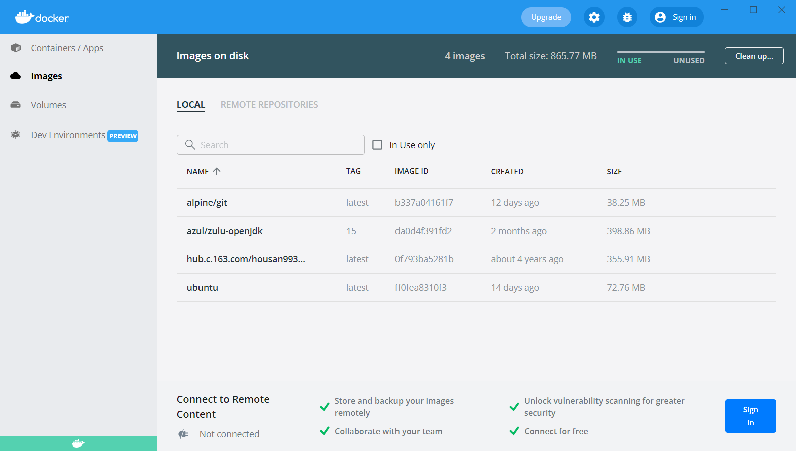
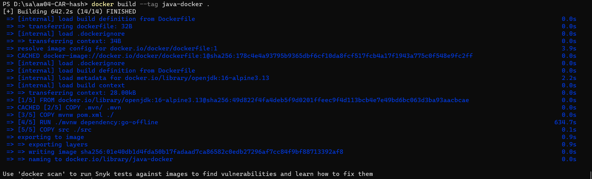
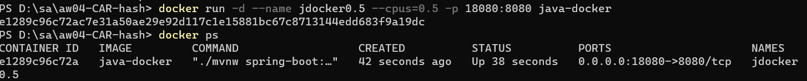
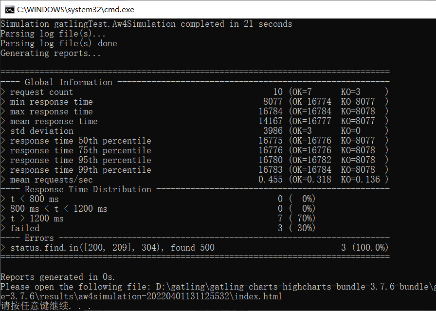
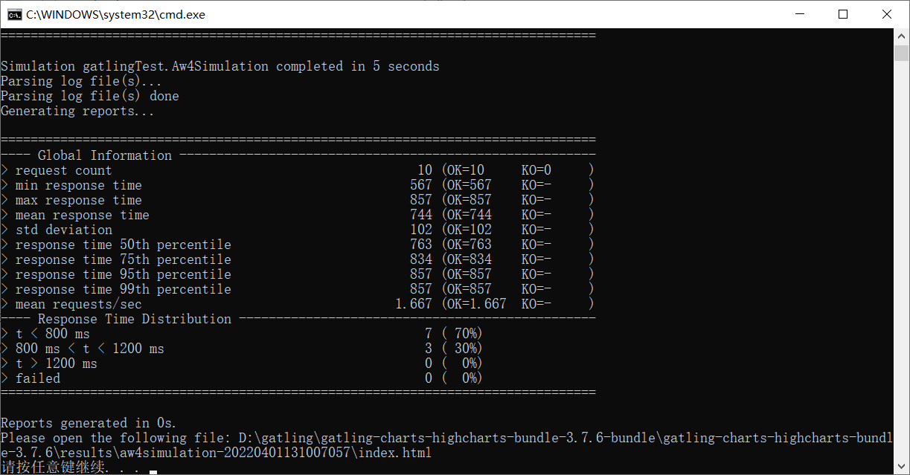
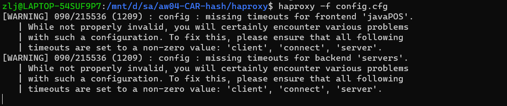
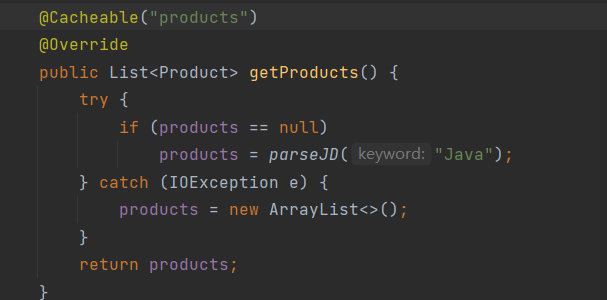
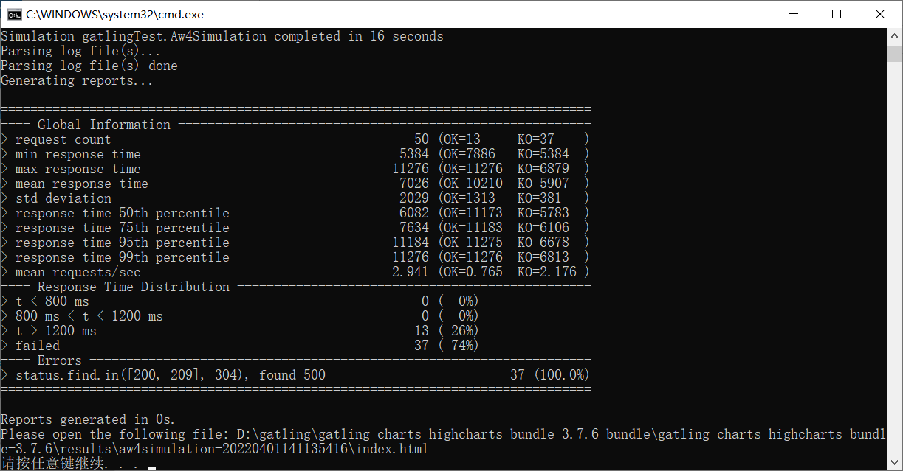
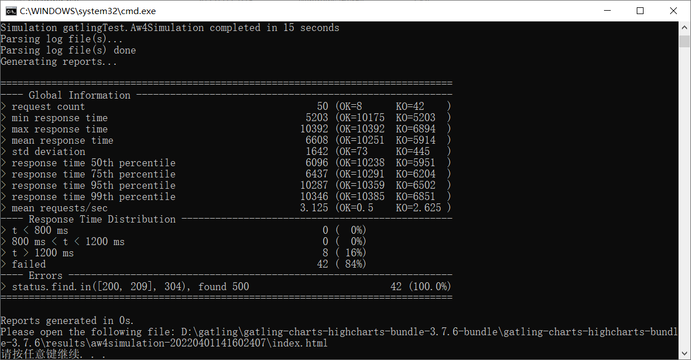
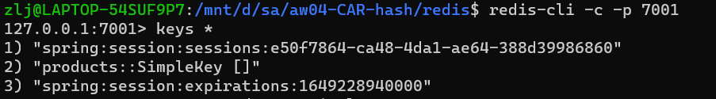

# 横向扩展实验报告

| 学号      | 姓名   |
| --------- | ------ |
| 191220162 | 张乐简 |

[TOC]

## 概述

​	利用docker进行容器级隔离，再通过haproxy进行横向扩展，再用gatline对其进行压力测试。

### 容器隔离

#### docker安装

​		在windows安装docker desktop。由于docker依赖于linux，需要先安装wsl。


​		接着安装docker desktop，直接走完指令即可。



#### 构建image

​		按官方文档，先构建Dockerfile和.dockerignore文件。

```dockerfile
# syntax=docker/dockerfile:1
FROM openjdk:16-alpine3.13
COPY .mvn/ .mvn
COPY mvnw pom.xml ./
RUN ./mvnw dependency:go-offline
COPY src ./src
CMD ["./mvnw","spring-boot:run"]
```

​		Dockerfile如上，将.mvn，mvnw，pom.xml这几个工具以及src源代码放入image。

```dockerfile
target
```

​		.dockerignore仅包含一行，意味不要将target拉入image。文件编写完以后，利用maven生成.jar包，并通过.jar包和Dockerfile构建image。



#### 在container中运行程序



​	如上，以0.5个cpu进行运行。

#### 压力测试

​	利用gatling分别对0.5和1个cpu的情况下进行测试。模拟10个user的情况。

```java
package gatlingTest; // 1

// 2
import io.gatling.javaapi.core.*;
import io.gatling.javaapi.http.*;

import static io.gatling.javaapi.core.CoreDsl.*;
import static io.gatling.javaapi.http.HttpDsl.*;

public class Aw4Simulation extends Simulation { // 3

    HttpProtocolBuilder httpProtocol = http // 4
            .baseUrl("http://localhost:8080") // 5
            .acceptHeader("text/html,application/xhtml+xml,application/xml;q=0.9,*/*;q=0.8") // 6
            .doNotTrackHeader("1")
            .acceptLanguageHeader("en-US,en;q=0.5")
            .acceptEncodingHeader("gzip, deflate")
            .userAgentHeader("Mozilla/5.0 (Windows NT 5.1; rv:31.0) Gecko/20100101 Firefox/31.0");

    ScenarioBuilder scn = scenario("Aw4Simulation") // 7
            .exec(http("request_1") // 8
                    .get("/")) // 9
            .pause(5); // 10

    {
        setUp( // 11
                scn.injectOpen(atOnceUsers(10)) // 12
        ).protocols(httpProtocol); // 13
    }
}
```

​	gatling文件如上，基本照搬官方网站文档。测试结果如下



​		0.5个cpu时有3次request被KO，且平均响应时间在14秒左右。



​	1个cpu时所有请求均通过，平均延时在0.7秒左右。差异巨大。

### 横向扩展

#### haproxy使用

​	在wsl中安装haproxy。接着，打开四个cpu=0.5的服务器，然后利用haproxy进行负载均衡。具体来说，设置以下的haproxy.cfg

```cfg
defaults
    mode tcp
frontend javaPOS
    bind *:8080
    default_backend servers
backend servers
    balance roundrobin
    server server1 localhost:8081
    server server2 localhost:8082
    server server3 localhost:8083
    server server4 localhost:8084
```

​	运行haproxy。



#### 压力测试

​	单个0.5cpu程序的性能已经在上面测试过，现在对这个由4个0.5cpu程序组成的服务器集群进行测试。


​	性能大幅提升。

#### 缓存

​	给getProducts加上缓存。后台的redis设置略去不谈，按https://redis.io/docs/manual/scaling/。



​	在4个cpu=0.5的情况下使用gatling、50个同时在线用户的情况下发出请求，结果如下：



​	几乎全军覆没，但是再请求50次。


​	平均响应时间下降到1秒，最短仅仅需要0.4秒。再在不使用缓存的情况下进行同样的测试。




​	最初的50次请求表现比有cache时互有优劣，OK数更少而平均响应时间更段；之后的50次可能因为有一些存在内存里的products起到了一定的缓存作用使得其响应时间下降，但比不过拥有共享缓存的上一次，平均反应时间在接近3秒。

检查一下redis的内容，发现cache和session全部被保存在了7001处。
